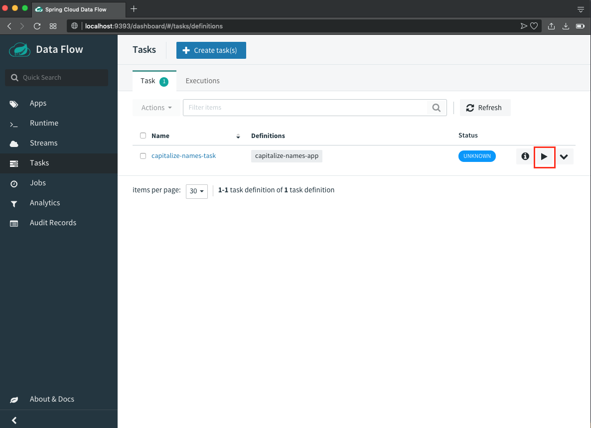

# Spring Cloud Data Flow Server

Run this project by this command : `mvn clean spring-boot:run`

Go to your browser then type : `http://localhost:9393/dashboard/#/apps`

### Screenshot

This will open the Spring Cloud Data Flow dashboard as shown below.

Now it’s time to add our Spring Batch Task application. Click on the `Add Application(s)` button.

")

Click on `Register one or more applications`.

")

Enter __capitalize-names-app__ as `name` of our application and select **Task** as `type`.

For the URI we enter the location of our Spring Boot Task JAR. In this example, the JAR file is located at: `file://path/to/your/spring-batch-admin/spring-batch-task/target/spring-batch-task-0.0.1-SNAPSHOT.jar`

Once done click on `Register the application(s)`.

")

Our application is now registered.

Now click on the `Task` menu to create a new task that we can execute.

Click on the `Create task(s)` button.

")

Drag the `Capitalize-Names-App` application on the canvas and connect the `START` and `END` nodes as shown below.

Click on `Create Task`.

")

Enter `capitalize-names-task` as task name and click on `Create the task`.

")

Our `capitalize-names-task` is now ready to be used. Click on the play icon to start an instance.

Click on the `Launch` the task button.

A new `Executions` tab now appears under the `Task` section. Click on it to consult the status of the task that we started.

We can see that there is one execution instance for our `capitalize-names-task`. Click on the information icon to see the details.

Click on the `Job Execution` Ids identifier to see detailed information on the batch job that was executed.

A new page opens that shows us the details on the Spring Batch `capitalizeNamesJob` job. We can even see the status and information on the step that was executed.

That’s it, we successfully used a Spring Batch Admin UI to launch a Spring Batch job!

> Note that you can also consult the log files of the executed batch job. Check the console output of the Spring Cloud Server for the location of the log files.

